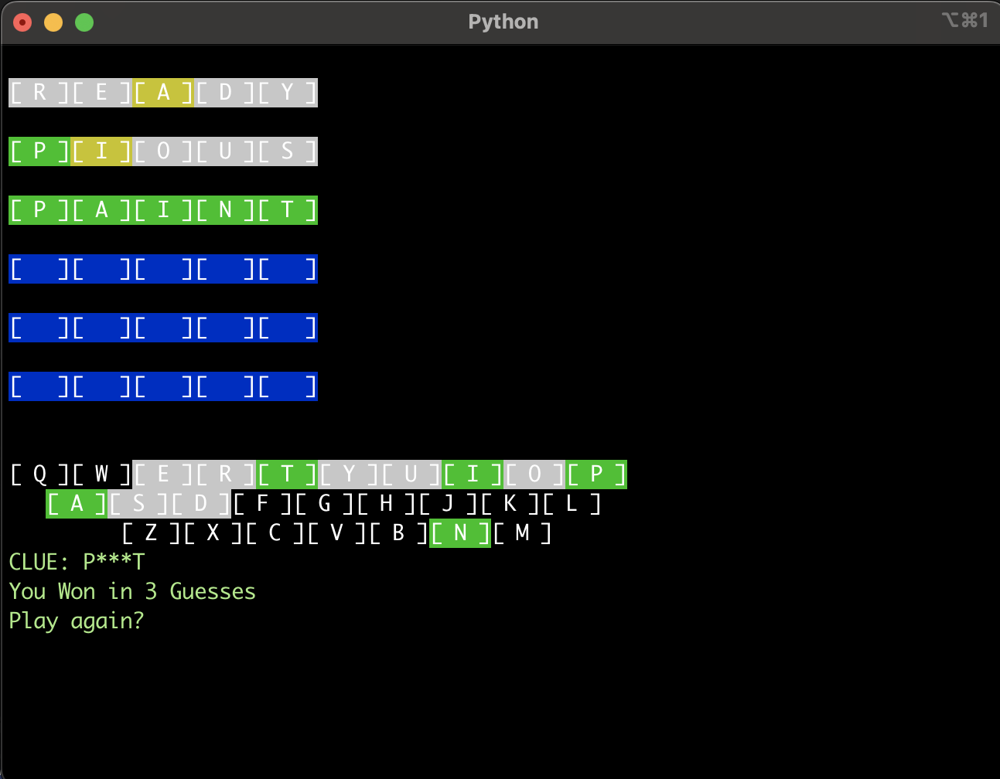

<h1>Wordies</h1>

 ```                       _ _           
                       | (_)          
 __      _____  _ __ __| |_  ___  ___ 
 \ \ /\ / / _ \| '__/ _` | |/ _ \/ __|
  \ V  V / (_) | | | (_| | |  __/\__ \
   \_/\_/ \___/|_|  \__,_|_|\___||___/
                                      
                                      
```

An unlimited 5 letter word guessing game, inpired by <a href="https://www.nytimes.com/games/wordle/index.html" target="_blank">Wordle<a/>

<h2>Installation</h2>
You will need <a href="https://python-poetry.org/">Poetry</a>

```
pip install poetry
```

clone the repository and run the following command to add dependencies
```
poetry install
```

after installing start the game by running the following command
```
poetry run start-game
```

<h2> Game Rules</h2>


- The user gets 6 chances to guess a 5 letter word.

- The interface is entirely command line and uses colorama and termcolor for the UI.

- The answer word list is credited to https://www.ef.edu/english-resources/english-vocabulary/top-3000-words/

- There is no limit on the number of times to play 

<h3> Extra Features</h3>
The game has a menu if you type *[command] (no spaces):

```
*clue
*debug
```

simply type * to see the menu options.

* CLUE: will display the first and last letters of the answer
* DEBUG will show the answer and other information
* Use ctrl+C to exit