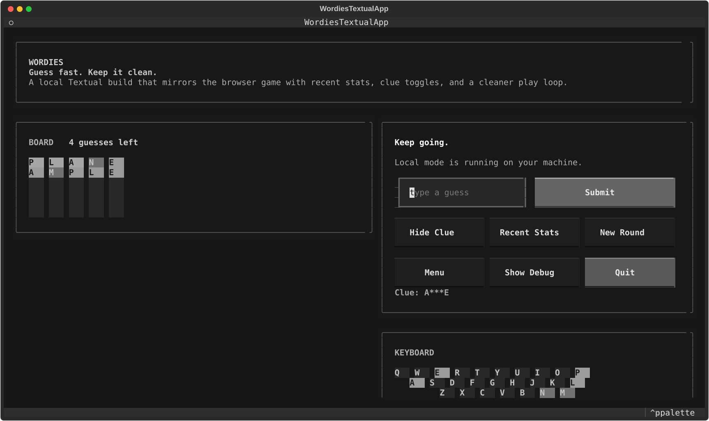

<h1>Wordies</h1>

```text
__      _____  _ __ __| |_  ___  ___
\ \ /\ / / _ \| '__/ _` | |/ _ \/ __|
 \ V  V / (_) | | | (_| | |  __/\__ \
  \_/\_/ \___/|_|  \__,_|_|\___||___/
```

An unlimited five-letter word guessing game for the terminal, inspired by <a href="https://www.nytimes.com/games/wordle/index.html" target="_blank">Wordle</a>.

## Terminal UI



## Highlights

- Modern terminal UI powered by <a href="https://textual.textualize.io/" target="_blank">Textual</a>
- Browser and terminal modes now share a closely matched play experience
- Wordle-style duplicate letter scoring
- Optional clue and debug modes
- Recent stats tracking for wins, losses, and guess counts
- Curated five-letter answers built from the included word list

## Installation

You will need <a href="https://python-poetry.org/" target="_blank">Poetry</a>.

```bash
pip install poetry
poetry install
```

Start the game with:

```bash
poetry run start-game
```

That now launches the modern Textual terminal UI by default.

Launch the local browser version with:

```bash
poetry run start-game --browser
```

If you want the older prompt-driven terminal mode:

```bash
poetry run start-game --classic
```

## How To Play

- You get 6 chances to guess a 5-letter word.
- Green means the letter is in the correct spot.
- Amber means the letter exists in the answer but is in the wrong spot.
- Gray means the letter is not in the answer.
- Use `Ctrl+C` to quit at any time.
- In the Textual terminal UI, you can also use buttons and keyboard shortcuts for clue, stats, debug, help, and new round.

## Commands

Type one of these commands at the guess prompt:

- `*menu` shows the available commands
- `*clue` toggles a first-letter and last-letter clue
- `*debug` toggles debug information for development
- `*stats` opens the recent performance modal
- `*new` starts a fresh round
- `*quit` exits the game

## Terminal Modes

- `poetry run start-game` runs the Textual terminal app
- `poetry run start-game --classic` runs the earlier Rich/prompt version
- Textual shortcuts: `c` toggles clue, `d` toggles debug, `s` opens stats, `n` starts a new round, `?` opens help, and `q` quits
- The Textual app mirrors the browser flow with a win banner, hidden guess form after a win, highlighted `New Round`, and a stats popup backed by a local history file

## Browser Mode

- `poetry run start-game --browser` starts a local web server and opens Wordies in your browser
- Use `--host` and `--port` if you want to bind to a different local address, for example `poetry run start-game --browser --port 9000`
- Browser mode keeps the same word rules and scoring as the terminal version
- Winning rounds trigger a celebration animation and spotlight the existing `New Round` action
- `Recent Stats` opens a local-storage-backed popup with your recent wins, losses, and guess counts

## Regression Checks

- Run the current regression suite with `./scripts/run_regression_checks.sh`
- The repo now includes a `.githooks/post-commit` hook that runs the same checks after every commit
- If you clone the repo elsewhere, re-enable the repo-local hooks with `git config core.hooksPath .githooks`

## Customization

The project is intentionally small, so it is easy to tweak:

- Update the answer source in [src/clues.py](src/clues.py) to change the vocabulary
- Adjust colors, panels, and board styles in [src/wordies.py](src/wordies.py)
- Swap the dictionary source in `VALID_WORDS` if you want looser or stricter validation
- Change `max_guesses` or `answer_len` if you want to experiment with other game modes

## Future UI Directions

If you want to keep pushing the feel of the app, these are the best next steps:

- Add richer Textual motion, like per-tile flips or staggered keyboard updates, now that the terminal UI already mirrors the browser layout
- Build a dedicated React frontend if you want the browser version to graduate from embedded HTML to a fuller component-driven app
- Explore <a href="https://reflex.dev/" target="_blank">Reflex</a> or <a href="https://nicegui.io/" target="_blank">NiceGUI</a> if you want a Python-first web stack with more app structure

## Word List Credit

The answer list is adapted from https://www.ef.edu/english-resources/english-vocabulary/top-3000-words/
